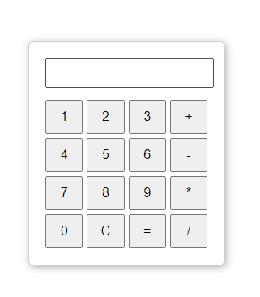

# Calculator App

This is a simple calculator application built with React. It allows users to perform basic arithmetic operations such as addition, subtraction, multiplication, and division.



## Features

- Basic arithmetic operations: addition, subtraction, multiplication, and division.
- Responsive design for use on various devices.
- Clear and user-friendly interface.

## Getting Started

These instructions will help you set up and run the calculator app on your local machine for development and testing purposes.

### Prerequisites

Ensure you have Node.js and npm installed on your machine. You can download them from [Node.js](https://nodejs.org/).

### Installation

1. Clone the repository:

   ```bash
   git clone https://github.com/oraykt/reactjs-calculator.git
   ```

2. Navigate to the project directory:

   ```bash
   cd calculator-app
   ```

3. Install the dependencies:

   ```bash
   npm install
   ```

### Running the App

To start the app in development mode, run:

```bash
npm start
```
The app will open in your default browser at [http://localhost:3000](http://localhost:3000).

## Usage

1. The calculator interface displays a numeric keypad and operation buttons
2. Click the number buttons to input values
3. Click operation buttons (+, -, ×, ÷) to perform calculations
4. Press "=" to see the result
5. Use "C" to clear the display and start over

## Built With

* [React](https://reactjs.org/) - The web framework used
* [Create React App](https://create-react-app.dev/) - Project bootstrapping
* [npm](https://www.npmjs.com/) - Package management

## Contributing

1. Fork the repository
2. Create your feature branch (`git checkout -b feature/AmazingFeature`)
3. Commit your changes (`git commit -m 'Add some AmazingFeature'`)
4. Push to the branch (`git push origin feature/AmazingFeature`)
5. Open a Pull Request

## License

This project is licensed under the MIT License - see the [LICENSE](LICENSE) file for details.

## Acknowledgments

* Inspired by basic calculator functionality
* Thanks to the React community for excellent documentation and resources
